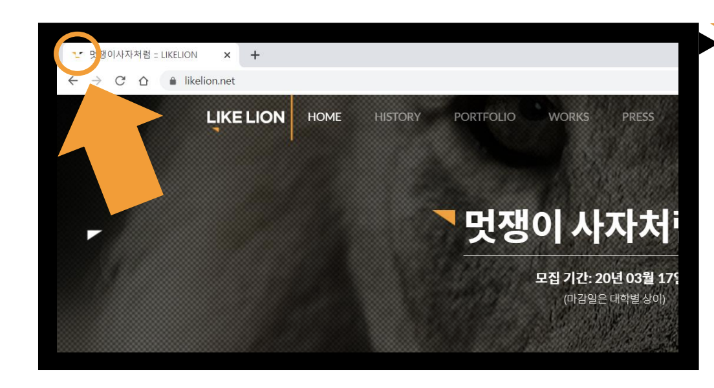
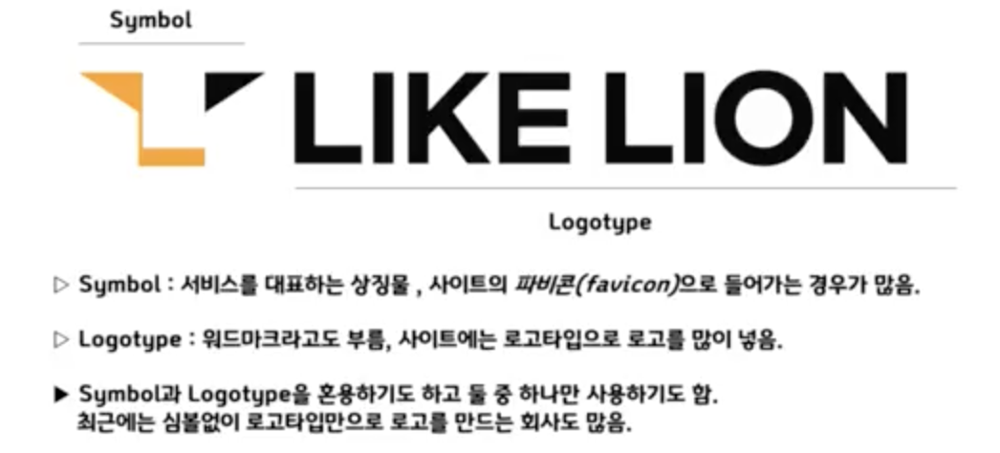
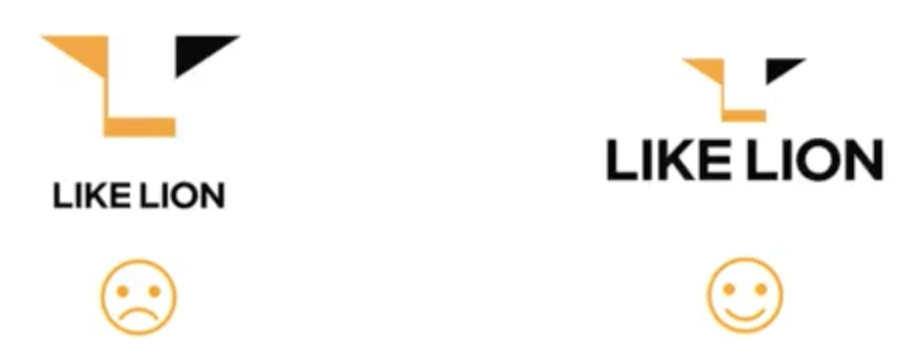
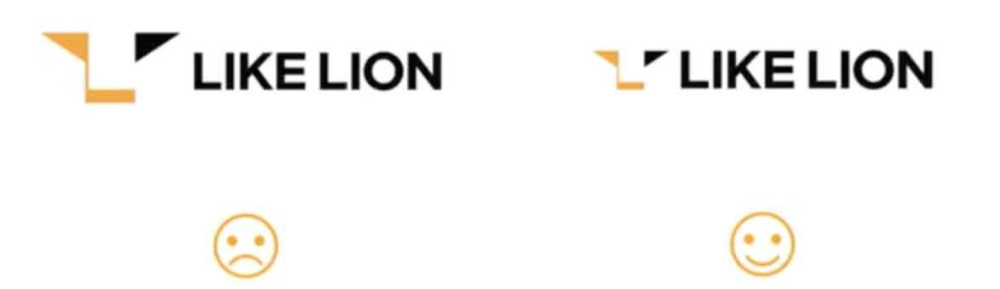
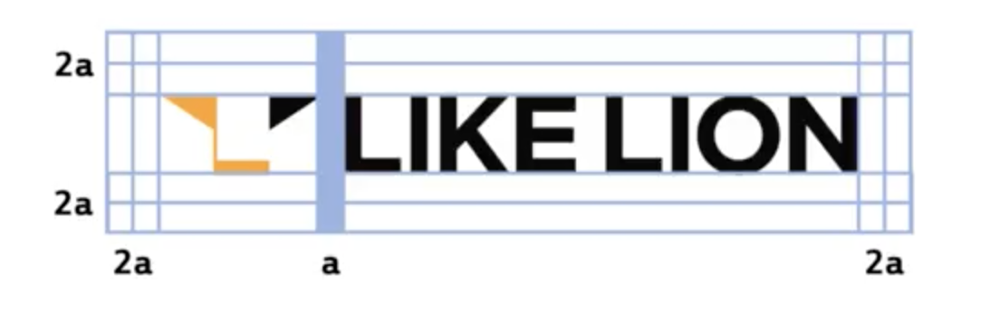
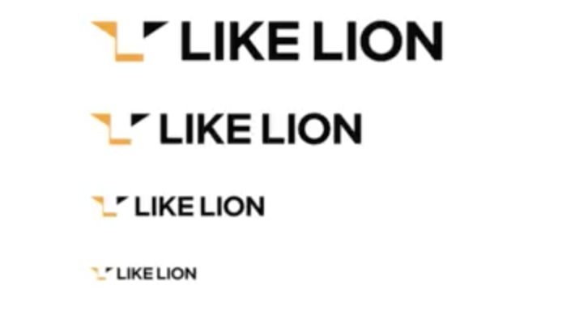
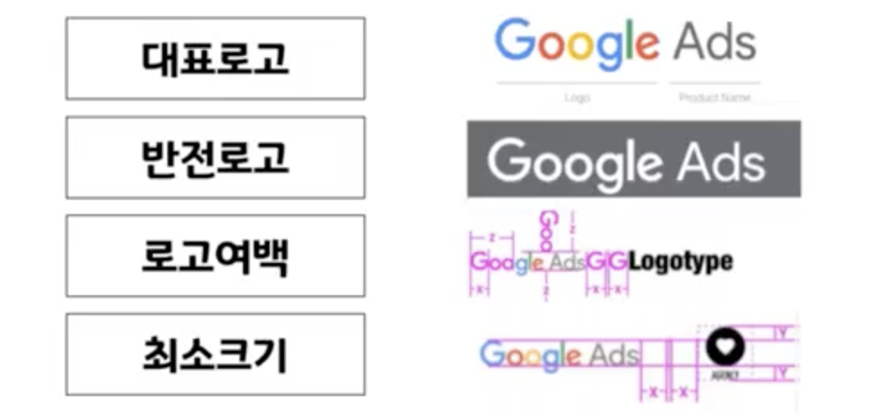
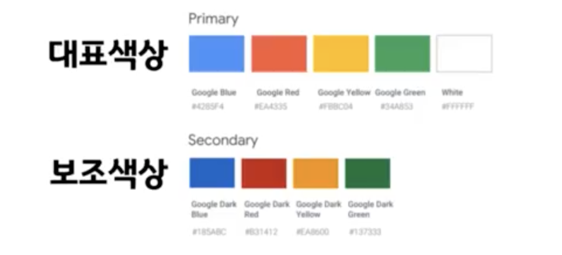
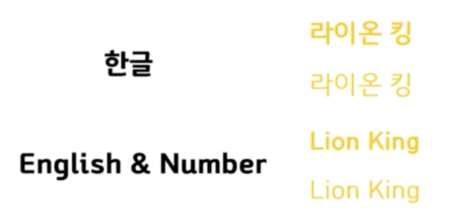

# 1.1주차 브랜드 디자인

## 브랜드 디자인

1. Brand name, color, font(2가지 굵기로)

    </img>

2. 파비콘

    </img>

3. 심볼 디자인

   1. 상징물 정하기
   2. 상징물 단순화하기
   3. 심볼 디자인

4. 풀 로고 (가로형, 세로형)

    </img>

   1. 로고의 전체적인 균형감

       </img>
       </img>

   2. 로고 주변 여유공간

       </img>

   3. 로고 사이즈
       </img>

5. 브랜드 디자인 가이드 형식

   1. 로고사용규정
       </img>

   2. 색상사용규정
       </img>

   3. 폰트 시스템
       </img>
